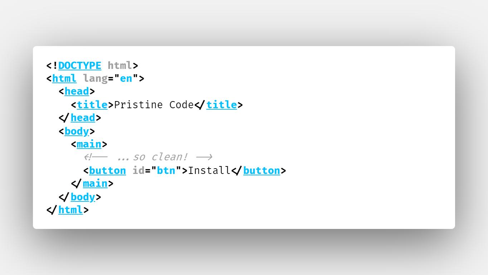
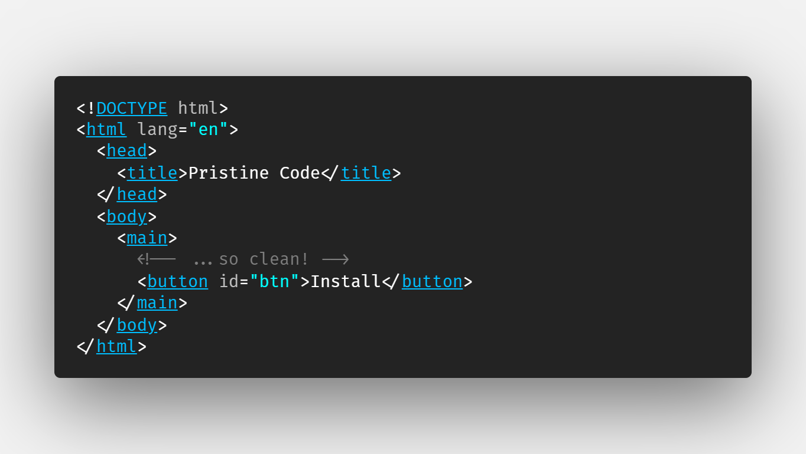
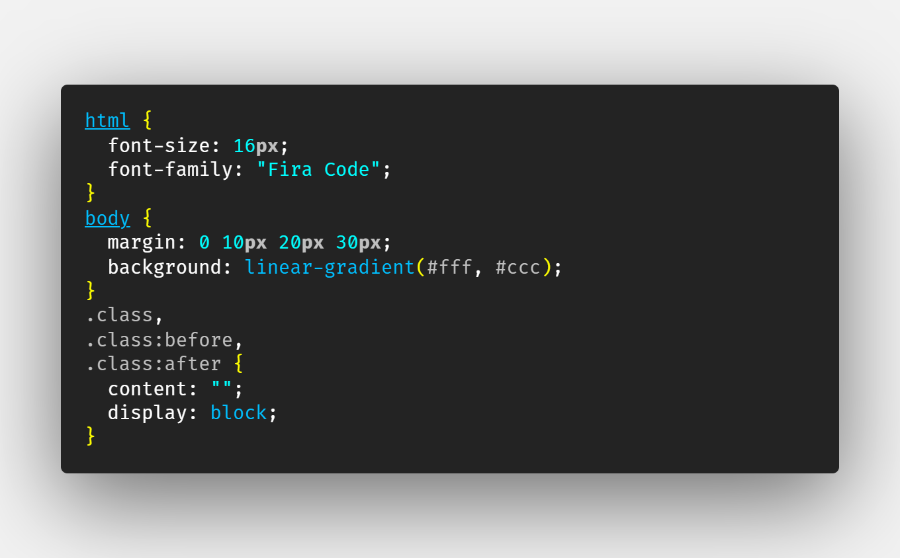
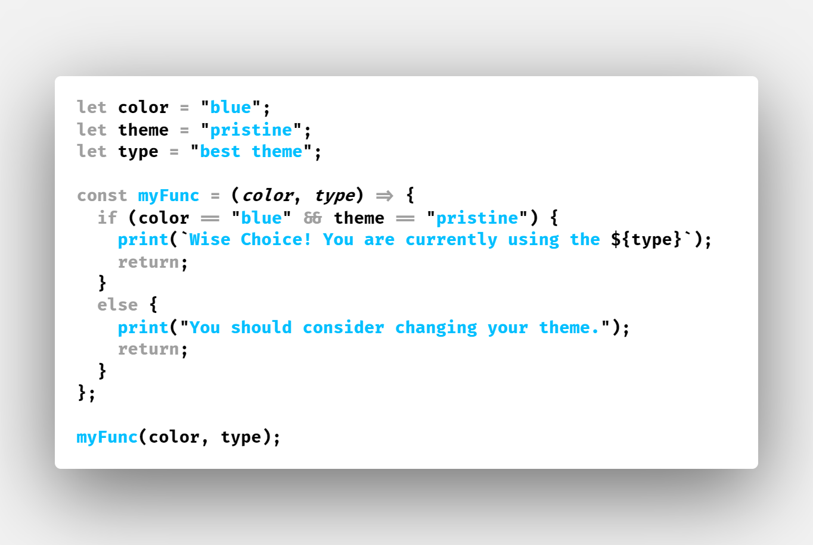
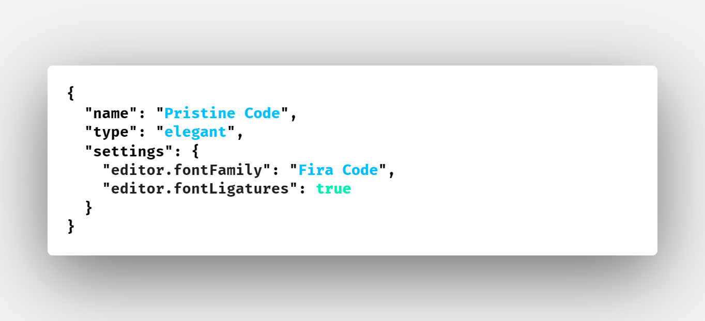
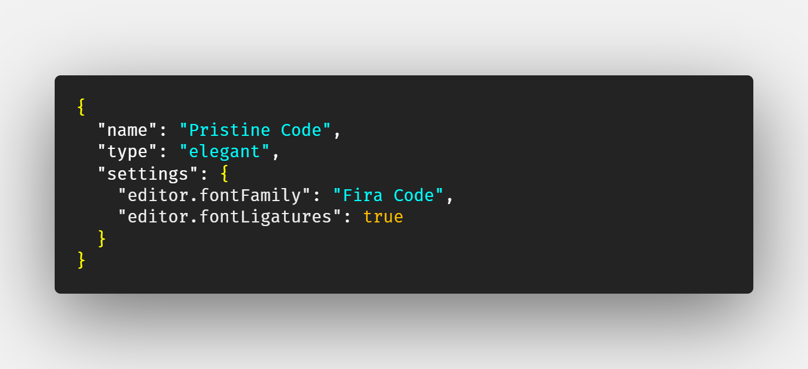
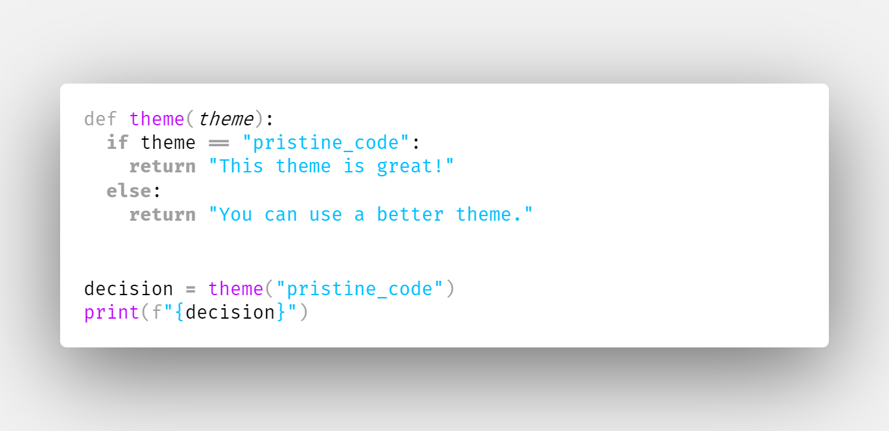
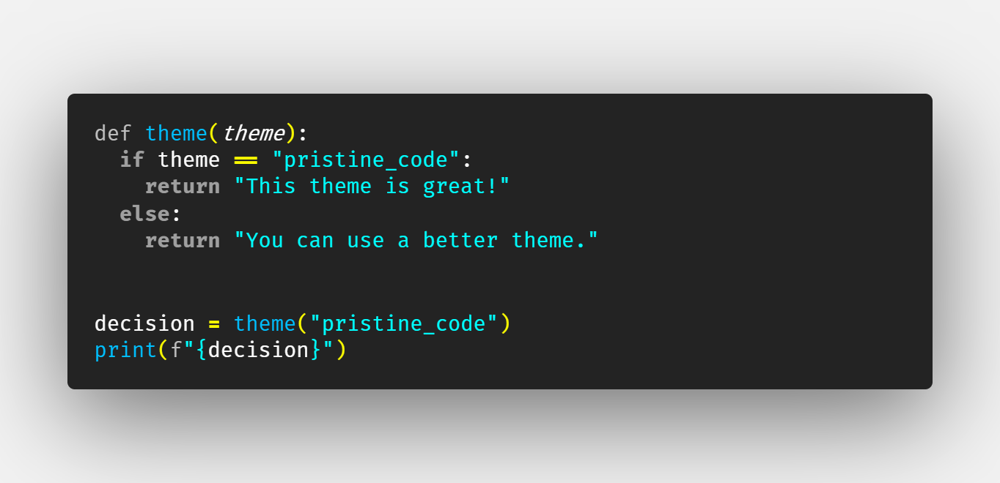
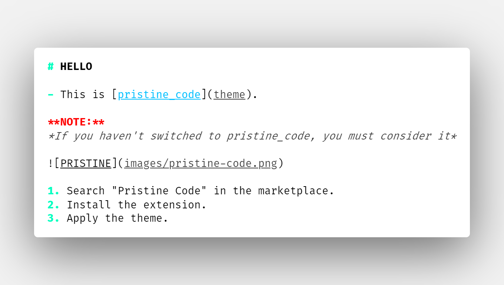
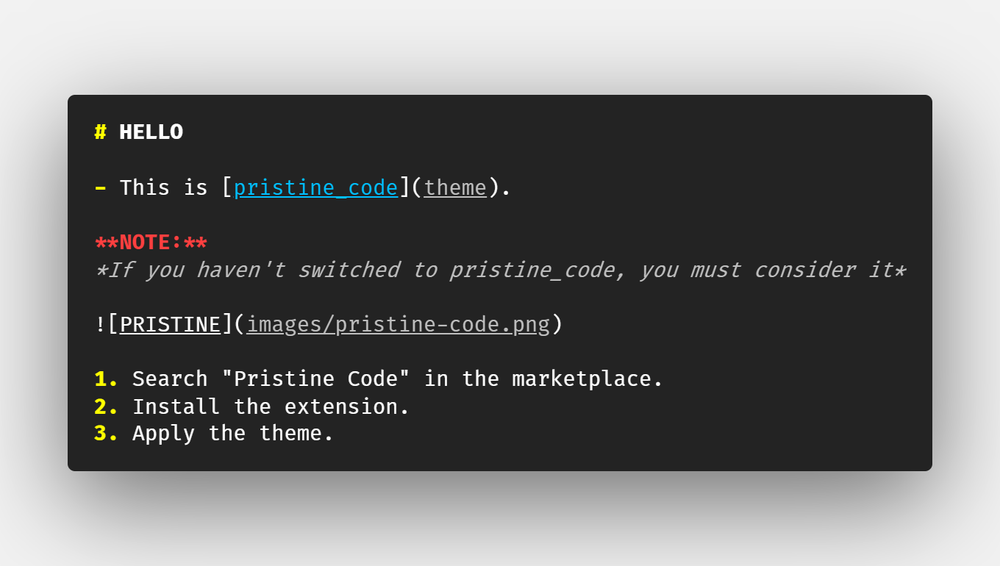

# PRISTINE CODE

The theme uses the shades of blue and gray to make to make the code look neat.

## OUTPUT

- [HTML](#html)
- [CSS](#css)
- [JAVASCRIPT](#javascript)
- [JSON](#json)
- [PYTHON](#python)
- [MARKDOWN](#markdown)

### HTML

#### HTML | LIGHT

#### HTML | DARK

### CSS

#### CSS | LIGHT

#### CSS | DARK

### JAVASCRIPT

#### JAVASCRIPT | LIGHT

#### JAVASCRIPT | DARK

### JSON

#### JSON | LIGHT

#### JSON | DARK

### PYTHON

#### PYTHON | LIGHT

#### PYTHON | DARK

### MARKDOWN

#### MARKDOWN | LIGHT

#### MARKDOWN | DARK

