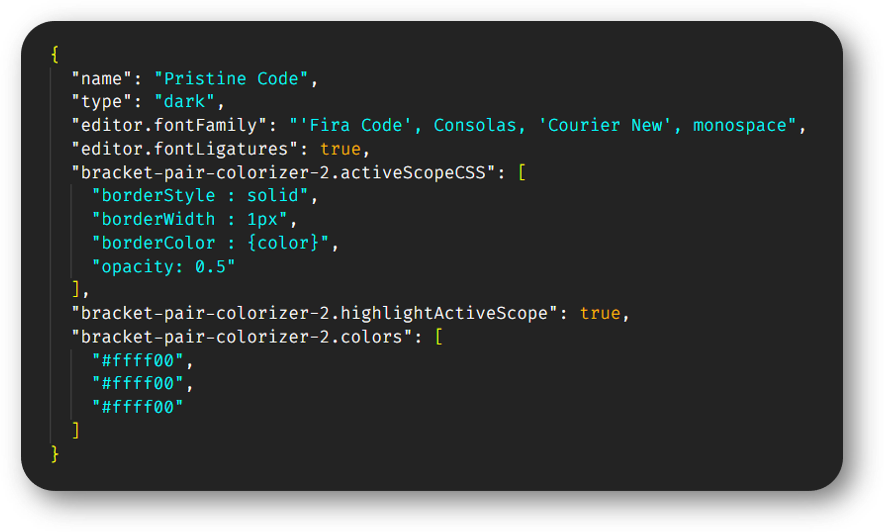

# PRISTINE CODE

The theme uses the shades of blue and gray to make to make the code look neat.

## OUTPUT

- [HTML](#html)
- [CSS](#css)
- [JAVASCRIPT](#javascript)
- [JSON](#json)
- [PYTHON](#python)
- [MARKDOWN](#markdown)

### HTML

### CSS

### JAVASCRIPT

### JSON

### PYTHON

### MARKDOWN

